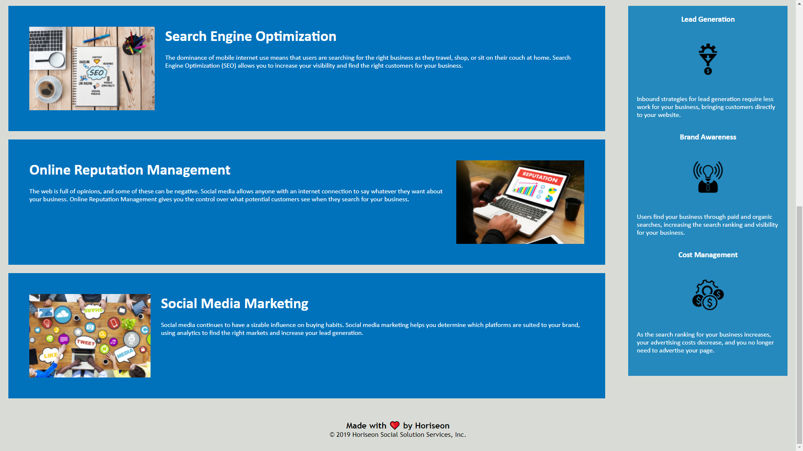

# 01-Homework
01 HTML, CSS, and Git: Code Refactor Homework
```
Improved existing code by implementing changes listed below.
```
Changelog:

```
Changed the title on html
Added alt attributes to images on html
Changed semantic tags in html and css
Added section id="search-engine-optimization" to corresponding section on html
Consolidated classes for primary text under article tag on css
Consolidated classes for secondary text under aside tag on css
Added comments on html and css
```

Screenshots:



Link: https://ronarceo.github.io/01-Homework/